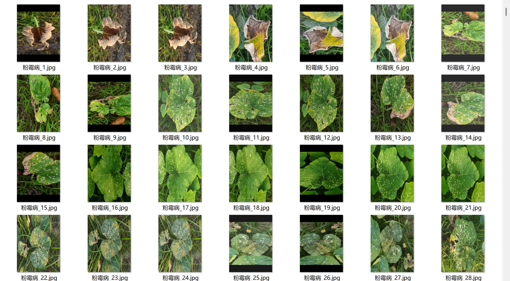
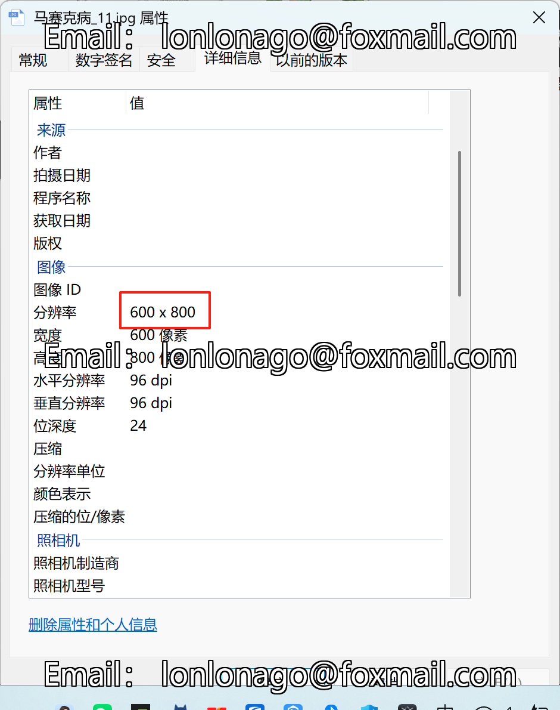
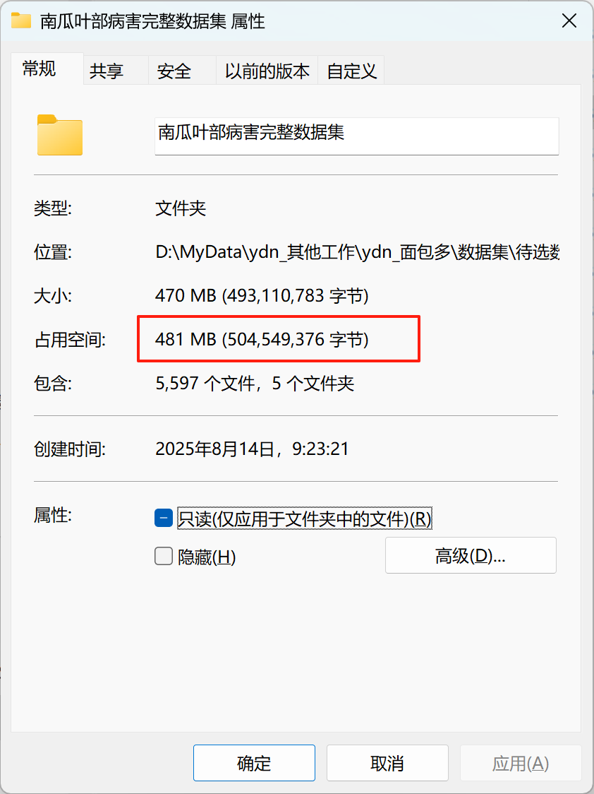

# Pumpkin Leaf Disease - Image Classification Dataset

Dataset Information Introduction:
- Number of images in the Healthy Leaves folder: 1100
- Number of images in the Powdery Mildew folder: 1128
- Number of images in the Blight Disease folder: 1135
- Number of images in the Microbial Leaf Blight folder: 1130
- Number of images in the Mosaic Disease folder: 1104
Total number of images in all subfolders: 5597

Images in the Folder Images
For inquiries, please direct your questions here. No friend verification is required; you can send messages directly to me, and I will see them.
When searching for me, please send your questions at once; I will respond to you. Sometimes I am busy, so you should describe your problem and intention clearly.
I will also respond to you when I am free, without needing formalities, which makes it more efficient.
Phone numbers are the same above; if I forget to respond or you are impatient, you can text or call.

## Images

Here is a pay link on Stripe ( https://buy.stripe.com/3cs8yP7sY87d0vu9AB ). Please contact me lonlonago@foxmail.com after funding $89, and I will send you a complete data files , thank you!

